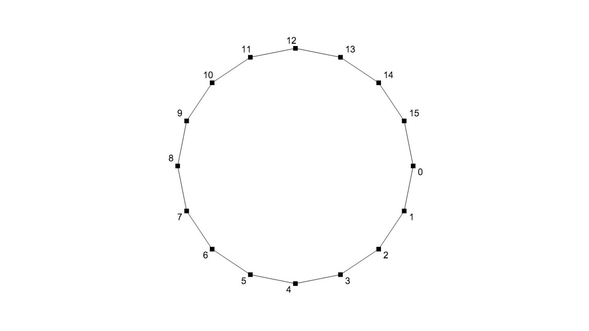

# primitive-circle

Creates circle geometry

## Usage

```javascript
var createCircle = require('primitive-circle')

var circle = createCircle(1, 32)
//circle = { positions: [[x,y], ...], cells: [[0, 1], [1,2], ...] }
```

## API

### `createCircle(r, segments)`

- `r` - radius of the circle
- `segments` - number of segments the circle will be made of

Returns geometry object with positions [x, y] and cells [i, j]

*Note: Points will be ordered clock-wise starting at 3pm*

## License

MIT, see [LICENSE.md](http://github.com/vorg/primitive-circle/blob/master/LICENSE.md) for details.
